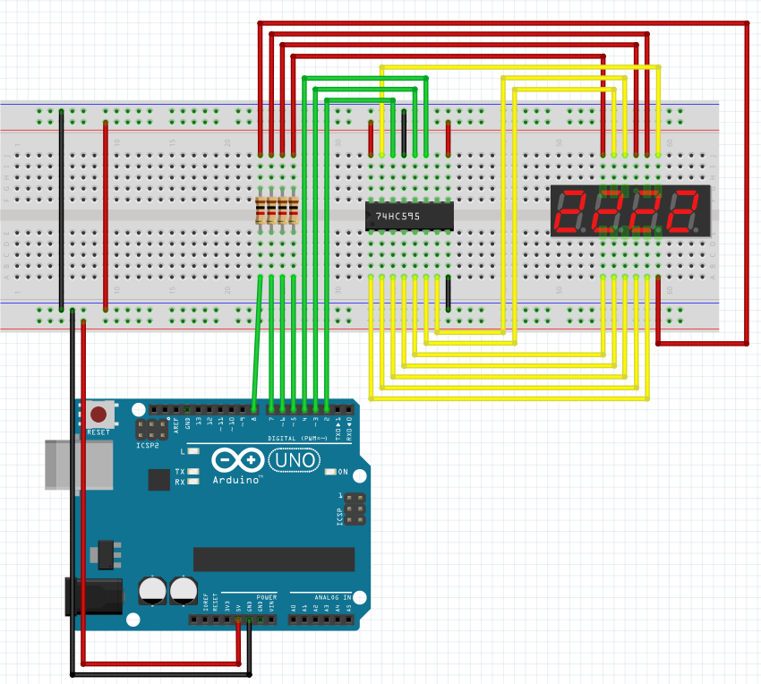

# Alarm clock with mp3 song support
This project spawned when my sister was looking to switch out her phone for an alarm clock.
She said that she easily wakes up in the morning so the normal alarm sounds are to harsh and
she would instead like to have nature sound like the ones usually available in wake up light
alarm clocks. I did a modest effort in trying to find what she wanted but when I finally
found an alarm clock that had nature sounds and no light the sound was horrible.
And now im here after thinking "how hard can it be to make an alarm clock that sounds decent?".

## The display
Any seven segment display with four digits should work for an alarm clock. I went with the largest available one.

Below is the wiring for the display + one button for incrementing the value shown.

## Display with shift register
A seven segment display require a lot of pins to operate, twelve for a display with four digits. To get around this I use a shift register to only use seven pins on the arduino instead of twelve.
